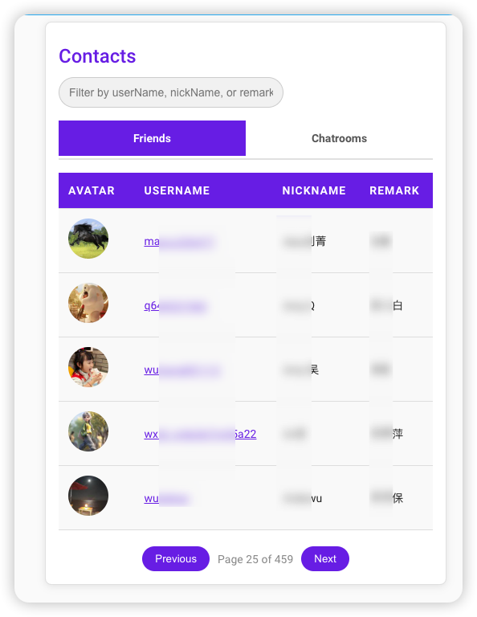

 
当然可以！下面是 `GeWe Notify Card` 项目的中文版本 `README.md` 文件：

---

# GeWe Notify Card

这是一个用于 **Home Assistant** 的自定义卡片，显示 **GeWe** 平台上的联系人、好友和聊天室。该卡片支持搜索、分页功能，并可以通过点击用户名将其复制到剪贴板，方便快速分享。
配合`https://github.com/netcookies/Gewe-Notify`集成使用。

## 特性

- **好友与聊天室**: 显示和管理您的联系人和聊天室。
- **搜索功能**: 可以根据用户名、昵称或备注过滤好友和聊天室。
- **剪贴板复制**: 点击用户名即可将其复制到剪贴板，方便粘贴和分享。
- **分页功能**: 当联系人或聊天室数量较多时，可以分页浏览。
- **响应式设计**: 适应不同的屏幕尺寸。

## 安装

### 步骤 1: 下载卡片

将该项目克隆或下载到 **Home Assistant** 的 `www` 文件夹中，或者使用 **HACS**（Home Assistant Community Store）来安装。

```bash
git clone https://github.com/netcookies/gewe-notify-card.git
```

### 步骤 2: 将卡片添加到 Home Assistant

1. 打开 **Home Assistant** 的 **Lovelace UI**。
2. 点击右上角的三个点，选择 **配置 UI**。
3. 点击右下角的 **+** 按钮来添加一个新卡片。
4. 选择 **手动卡片** 选项。
5. 粘贴以下 YAML 配置：

```yaml
type: custom:gewe-notify-card
```

### 步骤 3: 重新加载 Lovelace

添加卡片后，重新加载 Lovelace 配置以使更改生效。

## 配置

该卡片可以通过修改其 YAML 配置来进行自定义。以下是一个配置示例：

```yaml
type: custom:gewe-notify-card
```

## 使用方法

添加卡片后，它将自动显示您的联系人，并分为 **好友** 和 **聊天室** 两个标签页。您可以根据用户名、昵称或备注来搜索和过滤联系人。

- **点击用户名** 可以将其复制到剪贴板。
- 使用分页控件可以浏览更多联系人或聊天室。

## 屏幕截图

下面是 `GeWe Notify Card` 在 Home Assistant 中的实际展示：



## 故障排除

## 贡献

欢迎您在项目中提出问题、报告 bug 或提交 pull request。如果您有任何建议或改进，请随时打开 issue 或直接贡献代码。

## 许可证

本项目采用 **MIT License** 许可证，详情请查看 [LICENSE](LICENSE) 文件。

## 致谢

此卡片由 [netcookies](https://github.com/netcookies) 为 **Home Assistant** 社区创建。

---

### 说明：
- **插图**：请确保将 `readme.PNG` 图片放在与 `README.md` 同一目录下，或者根据实际路径调整图片的引用。
- **功能说明**：在中文版本中，我们详细介绍了卡片的各种功能，如剪贴板复制、分页等。
- **安装与配置**：为 Home Assistant 用户提供了简便的安装和配置步骤。
- **故障排除**：包括了剪贴板 API 无法工作时的常见问题和解决方案。
- **贡献**：鼓励社区用户提出问题和贡献代码。

你可以根据需要调整此 `README.md` 文件中的任何部分，以适应你的项目需求。如果有其他功能需要补充，请随时告诉我！
